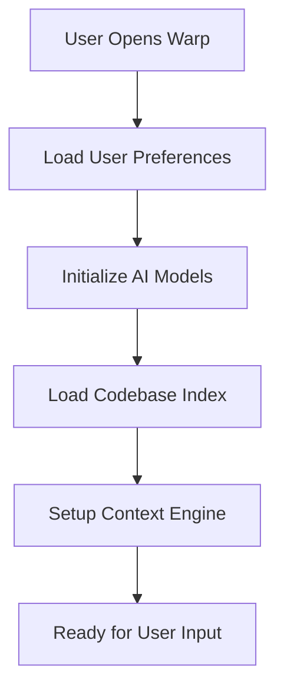
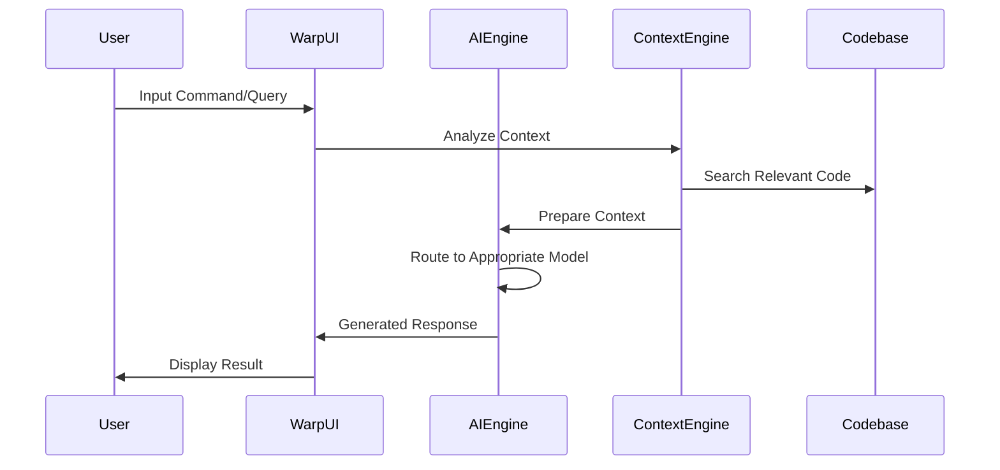
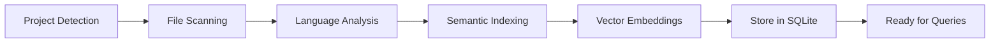
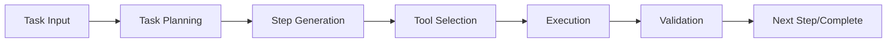

# Warp Terminal Logic & Workflow Analysis

## Ringkasan Eksekutif

Warp Terminal adalah terminal modern yang mengintegrasikan AI untuk memberikan pengalaman pengembangan yang lebih cerdas dan efisien. Dokumen ini menganalisis alur kerja internal Warp Terminal untuk memahami bagaimana aplikasi ini memproses kode, berinteraksi dengan pengguna, dan memahami kebutuhan developer.

## 1. Arsitektur Sistem Warp Terminal

### 1.1 Komponen Utama

```
┌─────────────────────────────────────────┐
│           WARP TERMINAL UI              │
├─────────────────────────────────────────┤
│  Agent Mode │  Coding Mode │ Planning   │
├─────────────────────────────────────────┤
│         AI Engine (LLM Router)          │
├─────────────────────────────────────────┤
│    Data Processing & Context Engine     │
├─────────────────────────────────────────┤
│  Codebase Index │ User Prefs │ History  │
├─────────────────────────────────────────┤
│           Terminal Core Engine           │
└─────────────────────────────────────────┘
```

### 1.2 Direktori Data dan Fungsinya

**Configuration Directory** (`~/.config/warp-terminal/`)
- **Fungsi**: Menyimpan preferensi pengguna, konfigurasi AI, dan pengaturan terminal
- **File Kunci**: `user_preferences.json`
- **Data Penting**:
  - Model AI yang tersedia dan preferensi
  - Tema dan pengaturaan UI
  - Konfigurasi telemetry
  - Status login pengguna

**State Directory** (`~/.local/state/warp-terminal/`)
- **Fungsi**: Menyimpan state aplikasi, database SQLite, dan indeks codebase
- **File Kunci**: 
  - `warp.sqlite` - Database utama aplikasi
  - `codebase_index_snapshots/` - Indeks codebase untuk AI
  - `warp.log` - Log aktivitas
- **Data Penting**:
  - Riwayat command dan session
  - Indeks semantic codebase
  - Cache AI responses

**Cache Directory** (`~/.cache/warp-terminal/`)
- **Fungsi**: Cache sementara untuk optimasi performa
- **Content**: Tema yang diunduh, cache AI, file temporary

## 2. Alur Kerja AI-Powered Terminal

### 2.1 Workflow Initialization



**Detail Proses:**

1. **Startup Sequence**:
   - Membaca `user_preferences.json` untuk mendapatkan konfigurasi AI
   - Memuat model AI yang tersedia (Claude, GPT, Gemini, dll.)
   - Menginisialisasi database SQLite untuk state management
   - Memuat indeks codebase jika tersedia

2. **Context Building**:
   - Scan working directory untuk mendeteksi project type
   - Load codebase index snapshots untuk semantic search
   - Setup environment variables dan shell integration

### 2.2 User Interaction Processing



**Jenis Input yang Diproses:**

1. **Terminal Commands**: Command tradisional dengan AI suggestions
2. **Natural Language Queries**: Pertanyaan dalam bahasa natural
3. **Code Analysis Requests**: Analisis kode dan debugging
4. **Agent Mode Tasks**: Task automation dan workflow management

### 2.3 AI Model Routing System

Berdasarkan analisis `user_preferences.json`, Warp menggunakan sistem routing AI yang canggih:

**Model Categories:**

1. **Agent Mode Models**:
   - Default: "auto" (Claude 4 Sonnet)
   - Options: GPT-5, Claude 4 Opus, Gemini 2.5 Pro
   - **Use Case**: Complex task automation, multi-step operations

2. **Coding Mode Models**:
   - Default: "auto" (Claude 4 Sonnet) 
   - **Use Case**: Code generation, debugging, refactoring

3. **Planning Mode Models**:
   - Default: O3 (high reasoning)
   - **Use Case**: Project planning, architecture decisions

**Routing Logic:**
```python
def route_ai_request(request_type, complexity, context):
    if request_type == "agent_mode":
        if complexity > 0.8:
            return "claude-4-opus"
        else:
            return "claude-4-sonnet"
    elif request_type == "coding":
        return "claude-4-sonnet"  # Best for code
    elif request_type == "planning":
        return "o3"  # Best reasoning model
```

## 3. Context Engine & Codebase Understanding

### 3.1 Codebase Indexing Process



**Proses Detail:**

1. **Project Detection**:
   - Scan untuk file konfigurasi (package.json, requirements.txt, go.mod)
   - Deteksi bahasa pemrograman dan framework
   - Identifikasi struktur project

2. **Semantic Indexing**:
   - Generate embeddings untuk functions, classes, modules
   - Buat graph hubungan antar komponen
   - Index documentation dan comments

3. **Context Enrichment**:
   - Analisis dependency antar file
   - Mapping import/export relationships
   - Identifikasi patterns dan best practices

### 3.2 Context-Aware Response Generation

**Input Processing Pipeline:**

```
User Query --> Context Analysis --> Codebase Search --> AI Processing --> Response
     ↓              ↓                    ↓               ↓            ↓
  Natural Lang   Working Dir       Semantic Search    Model Route   Smart Output
  Processing     Analysis          Vector Match       Selection     Generation
```

**Context Enrichment Factors:**

1. **Current Working Directory**: Path dan struktur folder
2. **File Context**: File yang sedang dibuka/diedit
3. **Git Status**: Branch, commits, changes
4. **Shell Environment**: Environment variables, PATH
5. **Command History**: Previous commands dan results
6. **Project Metadata**: Dependencies, configurations

## 4. Bagaimana Warp Memahami Kebutuhan User

### 4.1 Behavioral Analysis

**Telemetry & Learning:**
- Track command patterns dan frequency
- Analyze error rates dan debugging sessions
- Monitor AI interaction success rates
- Collect preference changes over time

**User Profiling:**
```json
{
  "user_patterns": {
    "primary_languages": ["JavaScript", "Python", "Go"],
    "common_workflows": ["git", "docker", "testing"],
    "error_frequencies": {"syntax": 45%, "runtime": 30%, "config": 25%},
    "ai_usage": {"agent_mode": 60%, "coding": 35%, "planning": 5%}
  }
}
```

### 4.2 Adaptive Intelligence

**Learning Mechanisms:**

1. **Command Success Prediction**:
   - Analyze which commands succeed/fail
   - Suggest alternatives untuk failed commands
   - Learn dari correction patterns

2. **Context-Sensitive Suggestions**:
   - Based on current project state
   - Historical success dalam similar contexts
   - Industry best practices integration

3. **Proactive Assistance**:
   - Detect common error patterns
   - Suggest optimizations
   - Recommend tools dan workflows

### 4.3 User Need Identification

**Categories of User Needs:**

1. **Immediate Task Completion**:
   - Quick command execution
   - Error resolution
   - File/code navigation

2. **Learning & Discovery**:
   - Understanding new concepts
   - Best practice guidance
   - Tool recommendations

3. **Workflow Optimization**:
   - Process automation
   - Efficiency improvements
   - Integration suggestions

4. **Problem Solving**:
   - Debugging assistance
   - Architecture decisions
   - Performance optimization

## 5. Advanced Features & Workflows

### 5.1 Agent Mode Deep Dive

**Agent Mode Capabilities:**



**Tool Integration:**
- File system operations
- Git version control
- Package managers (npm, pip, cargo)
- Build tools dan testing frameworks
- Deployment platforms

**Planning Engine:**
- Break complex tasks into steps
- Dependency analysis
- Risk assessment
- Progress tracking

### 5.2 Codebase Intelligence

**Advanced Code Understanding:**

1. **Semantic Search**:
   - Function/class similarity matching
   - Intent-based code discovery
   - Cross-file relationship mapping

2. **Code Quality Analysis**:
   - Pattern recognition
   - Best practice validation
   - Performance implications

3. **Refactoring Suggestions**:
   - Code smell detection
   - Architecture improvements
   - Modernization recommendations

### 5.3 Integration Ecosystem

**External Tool Integration:**

```
┌─────────────┐    ┌──────────────┐    ┌─────────────┐
│   Git VCS   │    │   Package    │    │   Cloud     │
│ Integration │<-->│  Managers    │<-->│ Platforms   │
└─────────────┘    └──────────────┘    └─────────────┘
       ↑                   ↑                   ↑
       └─────────────────────────────────────────
                      │
              ┌─────────────┐
              │    WARP     │
              │   CORE      │
              └─────────────┘
                      │
       ┌─────────────────────────────────────────┐
       ↓                   ↓                   ↓
┌─────────────┐    ┌──────────────┐    ┌─────────────┐
│   Docker    │    │   Testing    │    │    CI/CD    │
│ Container   │<-->│ Frameworks   │<-->│ Pipelines   │
└─────────────┘    └──────────────┘    └─────────────┘
```

## 6. Data Flow & Storage Strategy

### 6.1 Data Persistence

**SQLite Database Schema (Estimated):**

```sql
-- User sessions dan history
CREATE TABLE sessions (
    id INTEGER PRIMARY KEY,
    timestamp DATETIME,
    working_directory TEXT,
    shell_type TEXT,
    session_data JSON
);

-- Command history dengan context
CREATE TABLE commands (
    id INTEGER PRIMARY KEY,
    session_id INTEGER,
    command TEXT,
    result TEXT,
    exit_code INTEGER,
    execution_time REAL,
    context JSON
);

-- AI interactions
CREATE TABLE ai_interactions (
    id INTEGER PRIMARY KEY,
    user_query TEXT,
    ai_response TEXT,
    model_used TEXT,
    context_used JSON,
    success_rating REAL
);

-- Codebase index
CREATE TABLE codebase_index (
    id INTEGER PRIMARY KEY,
    file_path TEXT,
    content_hash TEXT,
    embeddings BLOB,
    metadata JSON,
    last_updated DATETIME
);
```

### 6.2 Privacy & Security

**Data Protection Measures:**

1. **Local-First Architecture**:
   - Sensitive data stored locally
   - Minimal cloud synchronization
   - User control over data sharing

2. **Encryption**:
   - Authentication tokens encrypted
   - SSH keys protected
   - Sensitive configurations secured

3. **Data Anonymization**:
   - Telemetry data anonymized
   - Code snippets sanitized
   - Personal information filtered

## 7. Performance Optimization

### 7.1 Response Time Optimization

**Latency Reduction Strategies:**

1. **Caching**:
   - AI response caching
   - Command result caching
   - Codebase index caching

2. **Predictive Loading**:
   - Pre-load common contexts
   - Background indexing
   - Model warm-up

3. **Smart Model Selection**:
   - Use lighter models for simple tasks
   - Route complex queries to powerful models
   - Fallback mechanisms

### 7.2 Resource Management

**System Resource Optimization:**

```
CPU Usage:
├── Terminal Core (30%)
├── AI Processing (40%)
├── Indexing Engine (20%)
└── UI Rendering (10%)

Memory Usage:
├── Codebase Index (40%)
├── AI Model Cache (35%)
├── User Data (15%)
└── System Buffers (10%)
```

## 8. User Experience Patterns

### 8.1 Common Workflows

**Developer Journey Mapping:**

1. **Project Initialization**:
   ```
   cd new-project → warp detects → offers setup assistance → 
   suggests best practices → creates optimal environment
   ```

2. **Development Cycle**:
   ```
   code changes → warp analyzes → suggests improvements → 
   runs tests → identifies issues → offers solutions
   ```

3. **Debugging Session**:
   ```
   error occurs → warp contextualizes → searches similar issues → 
   suggests fixes → validates solution → learns from outcome
   ```

### 8.2 User Feedback Integration

**Continuous Improvement Loop:**

```mermaid
circular_dependency_diagram TD
    A[User Interaction] --> B[Behavior Analysis]
    B --> C[Pattern Recognition]
    C --> D[Model Improvement]
    D --> E[Better Predictions]
    E --> F[Enhanced UX]
    F --> A
```

## 9. Future Evolution & Adaptability

### 9.1 Learning Capabilities

**Adaptive Systems:**

1. **Personal Assistant Evolution**:
   - Learn individual coding styles
   - Adapt to preferred workflows
   - Customize suggestions based on history

2. **Team Intelligence**:
   - Share best practices across team members
   - Collaborative problem-solving
   - Collective knowledge building

3. **Industry Adaptation**:
   - Stay updated with latest trends
   - Integrate new tools automatically
   - Evolve with ecosystem changes

### 9.2 Scalability Considerations

**Growth Strategy:**

```
Current State → Enhanced AI → Multi-Agent System → Ecosystem Integration
     ↓              ↓              ↓                    ↓
Single User → Team Collab → Organization → Industry Standard
```

## 10. Kesimpulan: Mengapa Warp Efektif

### 10.1 Kunci Keberhasilan

1. **Context-Aware Intelligence**:
   - Memahami tidak hanya command, tapi juga intent
   - Mengintegrasikan project context dengan user behavior
   - Memberikan solusi yang relevan dengan situasi specific

2. **Multi-Modal AI Integration**:
   - Kombinasi berbagai AI models untuk different use cases
   - Routing cerdas berdasarkan task complexity
   - Continuous learning dan improvement

3. **Developer-Centric Design**:
   - Built by developers untuk developers
   - Focus pada real-world workflows
   - Balance antara automation dan control

4. **Privacy-First Approach**:
   - Local data processing
   - User control over data sharing
   - Transparent about data usage

### 10.2 Value Proposition

**Untuk Individual Developers:**
- Reduced context switching
- Faster problem resolution  
- Learning acceleration
- Workflow optimization

**Untuk Teams:**
- Standardized best practices
- Knowledge sharing
- Consistent development environment
- Reduced onboarding time

**Untuk Organizations:**
- Increased developer productivity
- Better code quality
- Reduced debugging time
- Accelerated innovation cycles

---

## Appendix: Technical References

### A.1 File Locations Summary

```bash
# Configuration
~/.config/warp-terminal/user_preferences.json

# State & Database
~/.local/state/warp-terminal/warp.sqlite
~/.local/state/warp-terminal/codebase_index_snapshots/

# Cache
~/.cache/warp-terminal/

# Logs
~/.local/state/warp-terminal/warp.log
```

### A.2 Key Configuration Parameters

```json
{
  "TelemetryEnabled": true,
  "AvailableLLMs": "multi-model-routing-config",
  "AIRequestLimitInfo": "quota-and-usage-tracking",
  "IsSettingsSyncEnabled": true,
  "Notifications": "task-completion-alerts"
}
```

### A.3 Integration Points

- **Shell Integration**: Fish, Bash, Zsh
- **Version Control**: Git, SVN, Mercurial  
- **Package Managers**: npm, pip, cargo, go mod
- **Cloud Platforms**: AWS, GCP, Azure
- **CI/CD**: GitHub Actions, GitLab CI, Jenkins

---

*Dokumen ini merupakan analisis reverse engineering berdasarkan observasi behavior dan data struktur Warp Terminal. Implementasi actual mungkin berbeda, namun pola dan workflow yang diidentifikasi mencerminkan pengalaman user yang observable.*
